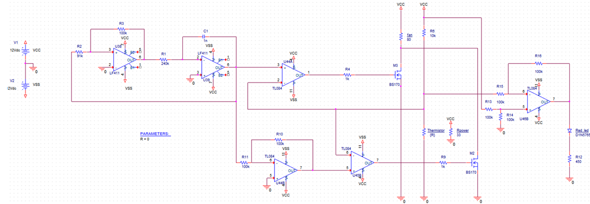

# Fan Speed Control Based on Temperature - PWM Circuit

This project implements a **temperature-controlled PWM (Pulse Width Modulation) circuit** to regulate a DC fan's speed based on temperature changes.
The system is designed to efficiently cool electronic components by adjusting the fan speed according to the measured temperature.

## Overview
The circuit generates a **PWM signal** based on a triangular waveform and a reference voltage (Vref) from a thermistor. As temperature increases, Vref decreases, resulting in a **higher duty cycle**, which increases fan speed.

## Circuit Diagram
Below is the circuit schematic used in this project:

## How It Works
1. **PWM Generation:**
   - An **integrator circuit** generates a triangular wave.
   - A **comparator** compares the triangular wave with the reference voltage (Vref).
   - The result is a PWM signal with a duty cycle that varies based on temperature.

2. **Temperature Sensing:**
   - A **thermistor** is used as a temperature sensor.
   - As the temperature rises, the thermistor’s resistance changes, altering Vref.

3. **Fan Speed Control:**
   - The PWM signal controls an **NMOS transistor (BS170)**.
   - The transistor switches the fan’s power, adjusting its speed.

4. **Indicator LED:**
   - A **differential amplifier** detects the thermistor's voltage drop.
   - The LED brightness increases with temperature, providing a visual indicator.

## Features
- **Automatic fan speed adjustment** based on temperature changes.
- **Efficient cooling mechanism** for electronic components.
- **PWM signal generation** for smooth speed transitions.
- **LED indicator** to display temperature changes.

## Components Used
- **Operational Amplifiers:** LF411, TL084
- **Transistors:** BS170 NMOS
- **Resistors & Capacitors:** Various values for signal conditioning
- **Thermistor:** Temperature sensor
- **DC Fan:** Speed controlled via PWM
- **LED Indicator:** Shows temperature change visually

## Results & Performance
- The circuit was tested and successfully increased fan speed as the temperature rose.
- A **50% duty cycle at ambient temperature (25°C)** resulted in ~6V to the fan.
- At **80°C, nearly 100% duty cycle** provided full 12V operation.

## Installation & Usage
1. Connect the components as per the circuit schematic.
2. Ensure proper power supply connections (12V for fan and op-amps).
3. Use a heat source to observe automatic fan speed control.
4. Monitor LED brightness changes as temperature increases.

## Possible Improvements
- Add **microcontroller-based control** for more precise fan speed regulation.
- Implement **hysteresis control** to avoid rapid fan switching.
- Include **data logging** for temperature and fan speed monitoring.

